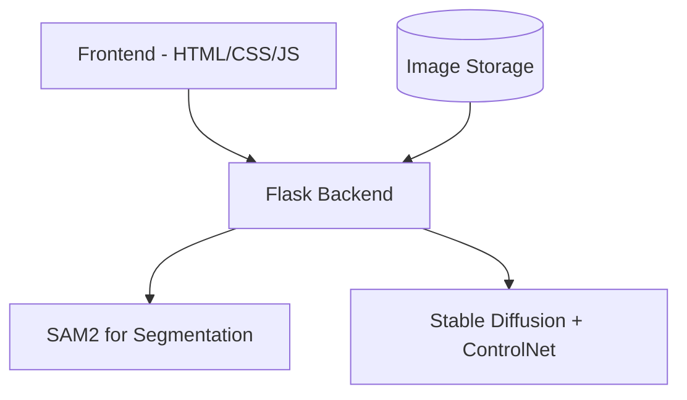

# Virtual Try-On Application Architecture

## Technology Stack


## System Components

1. **Frontend Layer**
   - Simple, responsive web interface
   - Image upload functionality
   - Preview capabilities
   - Progress indicators for processing steps

2. **Backend Layer (Flask)**
   ```mermaid
   sequenceDiagram
       participant User
       participant Frontend
       participant Flask Backend
       participant SAM2
       participant ControlNet
       
       User->>Frontend: Upload clothing image
       Frontend->>Flask Backend: Send image
       Flask Backend->>SAM2: Request segmentation
       SAM2-->>Flask Backend: Return mask
       Flask Backend->>ControlNet: Send mask + target model
       ControlNet-->>Flask Backend: Return generated image
       Flask Backend-->>Frontend: Return final result
   ```

3. **Image Processing Pipeline**
   - SAM2 for precise garment segmentation
   - Stable Diffusion with ControlNet for try-on generation
   ```mermaid
   graph LR
       A[Input Image] --> B[SAM2 Segmentation]
       B --> C[Mask Refinement]
       C --> D[ControlNet Processing]
       E[Human Model Template] --> D
       D --> F[Final Generated Image]
   ```

4. **Optimization Features**
   - Caching of segmentation results
   - Batch processing capability
   - Image compression before processing
   - Result optimization and enhancement

## Technical Details

1. **SAM2 Implementation**
   - Use Segment Anything Model 2 for accurate clothing segmentation
   - Implement automatic prompt generation for better segmentation
   - Include post-processing for mask refinement

2. **Stable Diffusion + ControlNet Setup**
   - Use ControlNet for precise control over garment placement
   - Implement inpainting for seamless integration
   - Use custom conditioning for style preservation
   - Optimize inference speed with model quantization

3. **Performance Optimizations**
   ```mermaid
   graph TD
       A[Input Processing] --> B[Image Compression]
       B --> C[Parallel Processing]
       C --> D[Result Caching]
       D --> E[Response Optimization]
   ```

4. **Security Measures**
   - Input validation
   - Image size limits
   - Rate limiting
   - Secure file handling

## Implementation Phases

1. **Phase 1: Basic Setup** (1-2 weeks)
   - Flask application setup
   - Basic frontend implementation
   - Image upload functionality
   - SAM2 integration

2. **Phase 2: Core Features** (2-3 weeks)
   - ControlNet integration
   - Basic try-on functionality
   - Image processing pipeline
   - Basic error handling

3. **Phase 3: Optimization** (1-2 weeks)
   - Performance improvements
   - Caching implementation
   - UI/UX enhancements
   - Error handling improvements

4. **Phase 4: Testing & Refinement** (1 week)
   - System testing
   - Performance optimization
   - Bug fixes
   - Documentation

## Advantages of This Architecture

1. **Quality**
   - SAM2 provides accurate segmentation
   - ControlNet ensures high-quality try-on results
   - Style preservation through proper conditioning

2. **Reliability**
   - Robust error handling
   - Fallback mechanisms
   - Consistent results

3. **Speed**
   - Optimized processing pipeline
   - Caching mechanisms
   - Parallel processing where possible
   - Compressed image handling